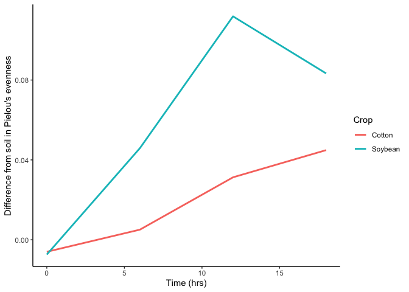

This assignment will help you practice integrating some of the tidyverse
functions into your R scripts. It will also involve some more practice
with GitHub. You may collaborate with a partner to enhance your learning
experience. Please ensure the following:

### Question 1

Download two .csv files from Canvas called DiversityData.csv and
Metadata.csv, and read them into R using relative file paths.

### Question 2

Join the two dataframes together by the common column ‘Code’. Name the
resulting dataframe alpha

``` r
library(tidyverse)
```

    ## Warning: package 'ggplot2' was built under R version 4.3.2

    ## Warning: package 'tidyr' was built under R version 4.3.2

    ## ── Attaching core tidyverse packages ──────────────────────── tidyverse 2.0.0 ──
    ## ✔ dplyr     1.1.4     ✔ readr     2.1.5
    ## ✔ forcats   1.0.0     ✔ stringr   1.5.1
    ## ✔ ggplot2   3.5.1     ✔ tibble    3.2.1
    ## ✔ lubridate 1.9.3     ✔ tidyr     1.3.1
    ## ✔ purrr     1.0.2     
    ## ── Conflicts ────────────────────────────────────────── tidyverse_conflicts() ──
    ## ✖ dplyr::filter() masks stats::filter()
    ## ✖ dplyr::lag()    masks stats::lag()
    ## ℹ Use the conflicted package (<http://conflicted.r-lib.org/>) to force all conflicts to become errors

``` r
alpha <- left_join(Metadata, DiversityData, by = "Code")
head(alpha)
```

    ##     Code Crop Time_Point Replicate Water_Imbibed  shannon invsimpson   simpson
    ## 1 S01_13 Soil          0         1            NA 6.624921   210.7279 0.9952545
    ## 2 S02_16 Soil          0         2            NA 6.612413   206.8666 0.9951660
    ## 3 S03_19 Soil          0         3            NA 6.660853   213.0184 0.9953056
    ## 4 S04_22 Soil          0         4            NA 6.660671   204.6908 0.9951146
    ## 5 S05_25 Soil          0         5            NA 6.610965   200.2552 0.9950064
    ## 6 S06_28 Soil          0         6            NA 6.650812   199.3211 0.9949830
    ##   richness
    ## 1     3319
    ## 2     3079
    ## 3     3935
    ## 4     3922
    ## 5     3196
    ## 6     3481

### Question

3.  4 pts. Calculate Pielou’s evenness index: Pielou’s evenness is an
    ecological parameter calculated by the Shannon diversity index
    (column Shannon) divided by the log of the richness column.

<!-- -->

1.  Using mutate, create a new column to calculate apl.
2.  Name the resulting dataframe alpha_even.

``` r
 # Create a new column called logRich
alpha <- mutate(alpha, logRich = log(richness)) # create new column named logRich that has the log of richness  # creating a new column of the log richness
alpha_even <- mutate(alpha, eveness_index = shannon / logRich) # create new column named Pielou’s evenness index that has the log of richness  
```

### Question 4

4.  4.  Pts. Using tidyverse language of functions and the pipe, use the
        summarise function and tell me the mean and standard error
        evenness grouped by crop over time.

<!-- -->

1.  Start with the alpha_even dataframe
2.  Group the data: group the data by Crop and Time_Point.
3.  Summarize the data: Calculate the mean, count, standard deviation,
    and standard error for the even variable within each group.
4.  Name the resulting dataframe alpha_average

``` r
alpha_average <- alpha_even %>% 
  group_by(Crop, Time_Point) %>% 
  summarise(mean.even =mean(eveness_index), n= n(),sd.dev =sd(eveness_index),std.err =sd.dev/sqrt(n))
```

    ## `summarise()` has grouped output by 'Crop'. You can override using the
    ## `.groups` argument.

### Question 5

5.  4.  Pts. Calculate the difference between the soybean column, the
        soil column, and the difference between the cotton column and
        the soil column

<!-- -->

1.  Start with the alpha_average dataframe
2.  Select relevant columns: select the columns Time_Point, Crop, and
    mean.even.
3.  Reshape the data: Use the pivot_wider function to transform the data
    from long to wide format, creating new columns for each Crop with
    values from mean.even.
4.  Calculate differences: Create new columns named diff.cotton.even and
    diff.soybean.even by calculating the difference between Soil and
    Cotton, and Soil and Soybean, respectively.
5.  Name the resulting dataframe alpha_average2

``` r
alpha_average2 <- alpha_average %>% 
  select(Time_Point, Crop, mean.even) %>% 
  pivot_wider(names_from = Crop, values_from = mean.even) %>% 
  mutate(diff.cotton.even =Soil - Cotton, diff.soybean.even =Soil - Soybean )
```

### Question 6

6.  4 pts. Connecting it to plots

<!-- -->

1.  Start with the alpha_average2 dataframe
2.  Select relevant columns: select the columns Time_Point,
    diff.cotton.even, and diff.soybean.even.
3.  Reshape the data: Use the pivot_longer function to transform the
    data from wide to long format, creating a new column named diff that
    contains the values from diff.cotton.even and diff.soybean.even.
4.  This might be challenging, so I’ll give you a break. The code is
    below.

pivot_longer(c(diff.cotton.even, diff.soybean.even), names_to = “diff”)

4.  Create the plot: Use ggplot and geom_line() with ‘Time_Point’ on the
    x-axis, the column ‘values’ on the y-axis, and different colors for
    each ‘diff’ category. The column named ‘values’ come from the
    pivot_longer. The resulting plot should look like the one to the
    right.

``` r
alpha_average2 %>%
select(Time_Point, diff.cotton.even, diff.soybean.even) %>%
pivot_longer(c(diff.cotton.even, diff.soybean.even), names_to = "diff") %>%
rename(Crop = diff) %>% # Just to make the plot look nice
mutate(Crop = str_replace(Crop, "diff.cotton.even", "Cotton")) %>% # Just to make the plot look nice
mutate(Crop = str_replace(Crop, "diff.soybean.even", "Soybean")) %>% # Just to make the plot look n
ggplot(aes(x = Time_Point, y = value, color = Crop)) +
geom_line(size = 1) +
labs(x = "Time (hrs)", y = "Difference from soil in Pielou's evenness") +
theme_classic()
```

    ## Warning: Using `size` aesthetic for lines was deprecated in ggplot2 3.4.0.
    ## ℹ Please use `linewidth` instead.
    ## This warning is displayed once every 8 hours.
    ## Call `lifecycle::last_lifecycle_warnings()` to see where this warning was
    ## generated.

<!-- -->

### Link to

<https://github.com/Damseltemi/PLPA_ClassAss/blob/main/CodingChallenge5.md>
