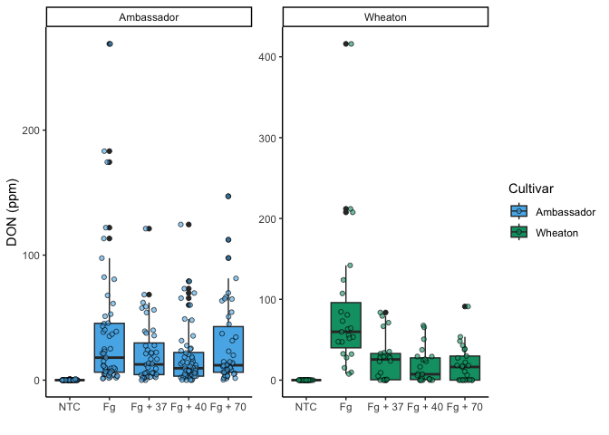
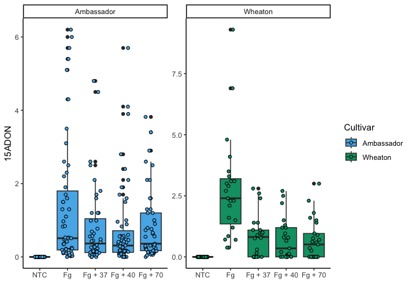
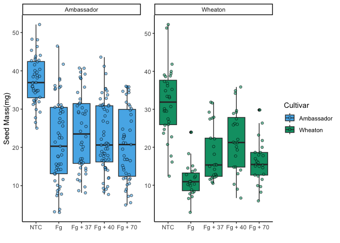
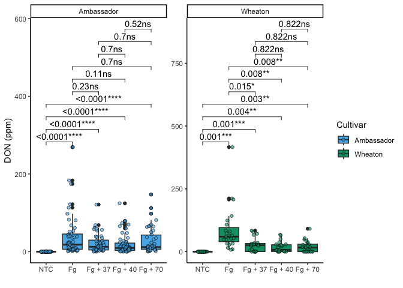
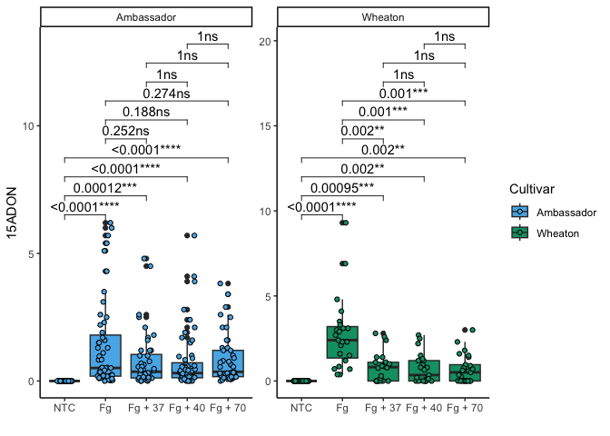
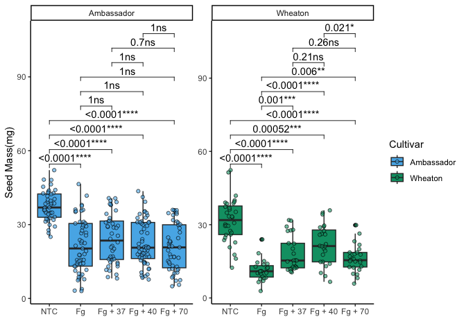
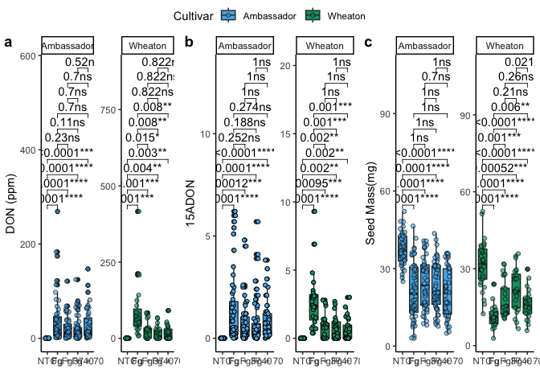

``` r
install.packages('tinytex')
tinytex::install_tinytex()
```

## Question 2a

### Link to Mycotoxin Manuscript

[Link to the
manuscript](https://apsjournals.apsnet.org/doi/10.1094/PDIS-06-21-1253-RE.md)

## Question 2b

``` r
library(tidyverse)
```

    ## Warning: package 'ggplot2' was built under R version 4.3.2

    ## Warning: package 'tidyr' was built under R version 4.3.2

    ## ── Attaching core tidyverse packages ──────────────────────── tidyverse 2.0.0 ──
    ## ✔ dplyr     1.1.4     ✔ readr     2.1.5
    ## ✔ forcats   1.0.0     ✔ stringr   1.5.1
    ## ✔ ggplot2   3.5.1     ✔ tibble    3.2.1
    ## ✔ lubridate 1.9.3     ✔ tidyr     1.3.1
    ## ✔ purrr     1.0.2     
    ## ── Conflicts ────────────────────────────────────────── tidyverse_conflicts() ──
    ## ✖ dplyr::filter() masks stats::filter()
    ## ✖ dplyr::lag()    masks stats::lag()
    ## ℹ Use the conflicted package (<http://conflicted.r-lib.org/>) to force all conflicts to become errors

``` r
library(ggpubr)
library(ggrepel)
library(knitr)
data1 <- read.csv("Data_Folder/MycotoxinData.csv",na.strings = "na")
```

## Question 2C

``` r
cbbPalette <- c("#000000", "#E69F00", "#56B4E9", "#009E73", "#F0E442", "#0072B2", "#D55E00", "#CC79A7")
data1$Treatment <- factor(data1$Treatment, levels = c ("NTC", "Fg", "Fg + 37", "Fg + 40", "Fg + 70"))
Plot1 <- ggplot(data1, aes(x = Treatment, y = DON, fill = Cultivar)) +
  geom_boxplot(position =  "dodge") +  # Boxplot with proper dodge width
  geom_jitter( pch = 21, alpha=0.6,position = position_jitterdodge(),color = "black") + # Adjusted jitter dodge
  xlab("") +
  ylab("DON (ppm)") +
  theme_classic() +
  #geom_jitter(pch=21,alpha=0.6,position = position_jitterdodge(),color="black")+
  scale_fill_manual(values = c(cbbPalette[[3]], cbbPalette[[4]]) ) +
  #scale_shape_manual(values = c(15, 16, 17, 18), name = "", labels = c("NTC", "Fg", "Fg +37", "Fg +40", "Fg +70")) 
  facet_wrap(~Cultivar, scales = "free")
Plot1
```

    ## Warning: Removed 8 rows containing non-finite outside the scale range
    ## (`stat_boxplot()`).

    ## Warning: Removed 8 rows containing missing values or values outside the scale range
    ## (`geom_point()`).

<!-- -->

``` r
Plot2 <- ggplot(data1, aes(x = Treatment, y = X15ADON, fill = Cultivar)) +
  geom_boxplot(position =  "dodge") +  # Boxplot with proper dodge width
  geom_jitter( pch = 21, position = position_jitterdodge(),color = "black") + # Adjusted jitter dodge
  xlab("") +
  ylab("15ADON") +
  theme_classic() +
  #geom_jitter(pch=21,alpha=0.6,position = position_jitterdodge(),color="black")+
  scale_fill_manual(values = c(cbbPalette[[3]], cbbPalette[[4]]) ) +
  #scale_shape_manual(values = c(15, 16, 17, 18), name = "", labels = c("NTC", "Fg", "Fg +37", "Fg +40", "Fg +70")) 
  facet_wrap(~Cultivar, scales = "free")
Plot2
```

    ## Warning: Removed 10 rows containing non-finite outside the scale range
    ## (`stat_boxplot()`).

    ## Warning: Removed 10 rows containing missing values or values outside the scale range
    ## (`geom_point()`).

<!-- -->

``` r
Plot3<-ggplot(data1, aes(x = Treatment, y = MassperSeed_mg, fill = Cultivar)) +
  geom_boxplot(position =  "dodge") +  # Boxplot with proper dodge width
  geom_jitter( pch = 21, alpha=0.6,position = position_jitterdodge(),color = "black") + # Adjusted jitter dodge
  xlab("") +
  ylab("Seed Mass(mg)") +
  theme_classic() +
  #geom_jitter(pch=21,alpha=0.6,position = position_jitterdodge(),color="black")+
  scale_fill_manual(values = c(cbbPalette[[3]], cbbPalette[[4]]) ) +
  #scale_shape_manual(values = c(15, 16, 17, 18), name = "", labels = c("", "Fg", "Fg +37", "Fg +40", "Fg +70")) +
  facet_wrap(~Cultivar, scales = "free")
Plot3
```

    ## Warning: Removed 2 rows containing non-finite outside the scale range
    ## (`stat_boxplot()`).

    ## Warning: Removed 2 rows containing missing values or values outside the scale range
    ## (`geom_point()`).

<!-- -->

``` r
### Plots with t-test as significance levels
Plot1a <- Plot1 + 
  geom_pwc(aes(group = Treatment), method = "t_test", label = "{p.adj.format}{p.adj.signif}")
Plot1a
```

    ## Warning: Removed 8 rows containing non-finite outside the scale range
    ## (`stat_boxplot()`).

    ## Warning: Removed 8 rows containing non-finite outside the scale range
    ## (`stat_pwc()`).

    ## Warning: Removed 8 rows containing missing values or values outside the scale range
    ## (`geom_point()`).

<!-- -->

``` r
### Example with combined pvalue and * to indicate significance
Plot2a <- Plot2 + 
  geom_pwc(aes(group = Treatment), method = "t_test", label = "{p.adj.format}{p.adj.signif}")
Plot2a
```

    ## Warning: Removed 10 rows containing non-finite outside the scale range
    ## (`stat_boxplot()`).

    ## Warning: Removed 10 rows containing non-finite outside the scale range
    ## (`stat_pwc()`).

    ## Warning: Removed 10 rows containing missing values or values outside the scale range
    ## (`geom_point()`).

<!-- -->

``` r
Plot3a <- Plot3 + 
  geom_pwc(aes(group = Treatment), method = "t_test", label = "{p.adj.format}{p.adj.signif}")
Plot3a
```

    ## Warning: Removed 2 rows containing non-finite outside the scale range
    ## (`stat_boxplot()`).

    ## Warning: Removed 2 rows containing non-finite outside the scale range
    ## (`stat_pwc()`).

    ## Warning: Removed 2 rows containing missing values or values outside the scale range
    ## (`geom_point()`).

<!-- -->

``` r
#Combine all plot
figure_comba <- ggarrange(
  Plot1a,# First plot: water.imbibed
  Plot2a,
  Plot3a,  # Second plot: bac.even
  labels = "auto",  # Automatically label the plots (A, B, C, etc.)
  nrow = 1,  # Arrange the plots in 3 rows
  ncol = 3, # Arrange the plots in 1 column
  common.legend = TRUE
  #legend = TRUE  # Do not include a legend in the combined figure
)
```

    ## Warning: Removed 8 rows containing non-finite outside the scale range
    ## (`stat_boxplot()`).

    ## Warning: Removed 8 rows containing non-finite outside the scale range
    ## (`stat_pwc()`).

    ## Warning: Removed 8 rows containing missing values or values outside the scale range
    ## (`geom_point()`).

    ## Warning: Removed 8 rows containing non-finite outside the scale range
    ## (`stat_boxplot()`).

    ## Warning: Removed 8 rows containing non-finite outside the scale range
    ## (`stat_pwc()`).

    ## Warning: Removed 8 rows containing missing values or values outside the scale range
    ## (`geom_point()`).

    ## Warning: Removed 10 rows containing non-finite outside the scale range
    ## (`stat_boxplot()`).

    ## Warning: Removed 10 rows containing non-finite outside the scale range
    ## (`stat_pwc()`).

    ## Warning: Removed 10 rows containing missing values or values outside the scale range
    ## (`geom_point()`).

    ## Warning: Removed 2 rows containing non-finite outside the scale range
    ## (`stat_boxplot()`).

    ## Warning: Removed 2 rows containing non-finite outside the scale range
    ## (`stat_pwc()`).

    ## Warning: Removed 2 rows containing missing values or values outside the scale range
    ## (`geom_point()`).

``` r
figure_comba
```

<!-- -->
