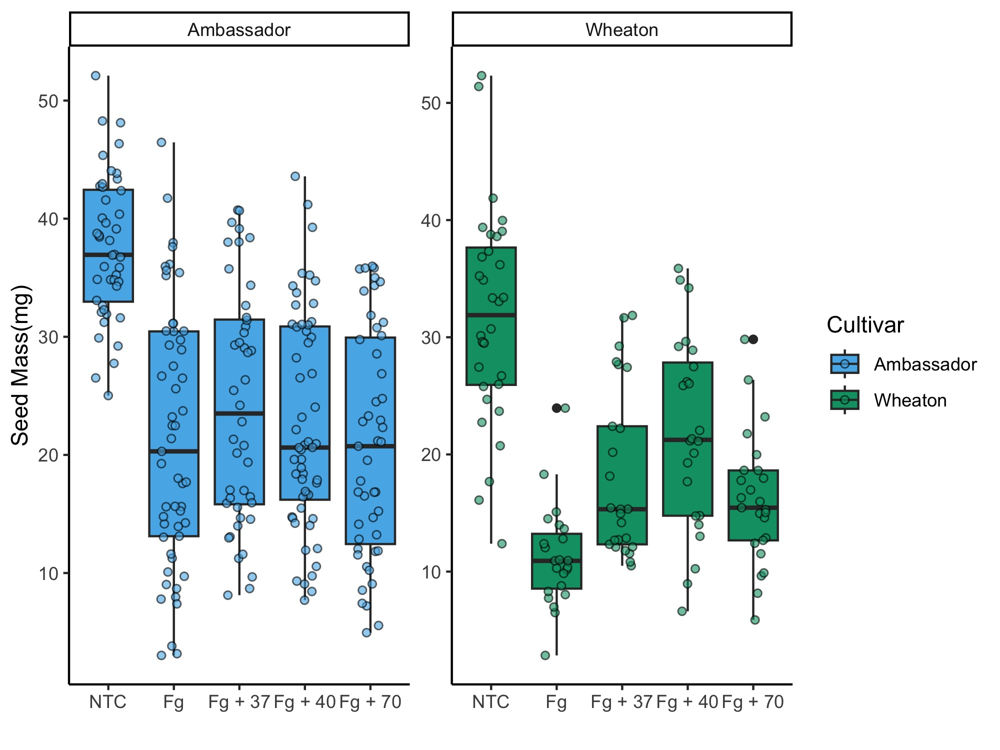

This is an example of R code
```{r setup, include=TRUE}
# this is R code
summary(mtcars)
```
This is to include figures
```{r setup2, include=TRUE}
library(ggplot2)
data("mtcars")
ggplot(mtcars, aes(x=wt, y=mpg)) +
  geom_point()
```

R markdown formatting options

# First level header
**this is a italics**
## second level header

- one time
- another item
- one subitem
  1. One item
  2. second time
  -sub item
  -Name of important pest
  *Zonocerus*
  **Zonocerus** 
  
### third level header

### Links
[Link to my github](https://auburn.instructure.com/courses/1629066/pages/markdown?module_item_id=34890510b) 

### Image


### Formatted tables
```{r}
library(knitr)
kable(head(mtcars, n = 5), digits = 3, format = "markdown")
```


